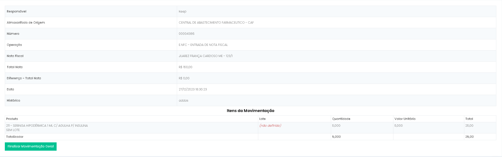
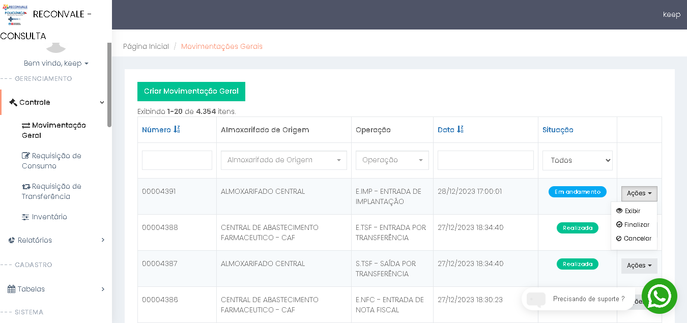
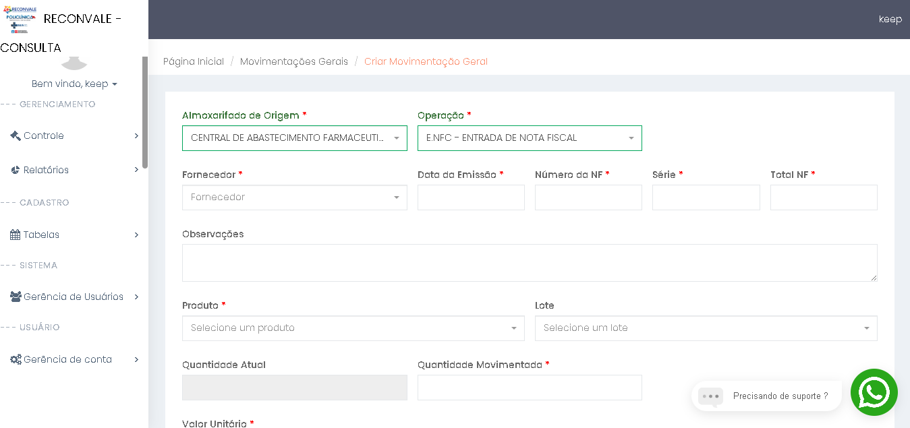
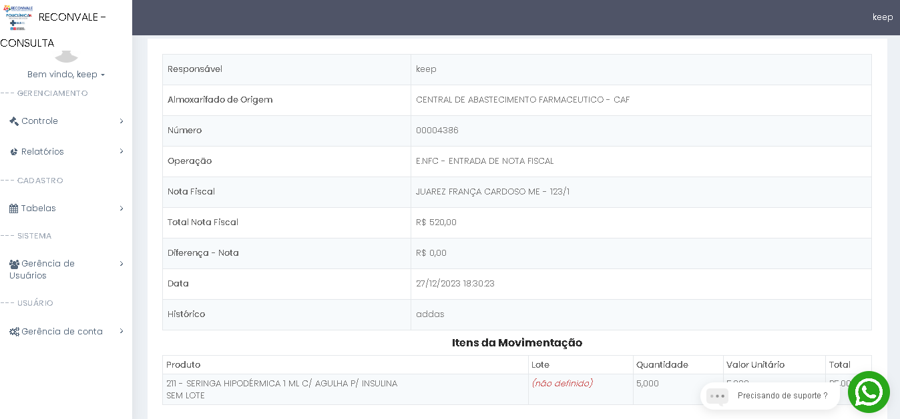

# 1. Conferencia e Ajuste de emissão: ⚙️

## ✅ - Objetivo :

### 🧑🏻- Solicitação usuário:

O sistema deve permitir que as entradas de notas fiscais possam ser continuada no dia seguinte e alteradas futuramente caso algum erro seja detectado.

---

### 💻 - Rota/tela:

**✅ -  Alteração (Movimentação Geral):**

- http://www.keepinformatica.com/almoxarifado/web/movimentacao-geral/index;
- http://www.keepinformatica.com/almoxarifado/web/movimentacao-geral/create
- http://www.keepinformatica.com/almoxarifado/web/movimentacao-geral/view?id=id

  ⚙️- **Criação nova tela:**
- http://www.keepinformatica.com/almoxarifado/web/movimentacao-geral/finalizar?id=id

---

### 📃 - Descrição:

Devida a requisição do usuario sera necessario a criação de um nova **situação** em **"Movimentação Geral"** que sera **"em andamento"** tornando possivel usuario salvar movimentação sem necessariamente finalizar, podendo voltar e adicionar novos produtos a nota em outro momento, juntamente ao novo status sera necessario criação de uma nova tela e um novo botão que ficara disponivel em ações que sera "Finalizar" com a funcionalidade de concluir processo da nota tornando status da movimentação em "Realizada".  Outra parte dos ajuste e a criação de novos campos como "valor total da nota" e "diferença", que servirão para afins de calculo evitando erros ao finalizar.

---

### ☑️ - Resumo das alterações:

* [X]  Criação de uma nova **Situação** - **"Em andamento"** - para indicar que o processo da nota ainda não foi concluida;
* [X]  Nova opção em ações **"Finalizar"** dentro da view da **"Movimentação Geral"**;
* [X]  Criação de uma nova tela de **finalização** da nota;

---

## 💻 - Modelagem view - Código exemplo:

### 🛠️- View alterada:

#### ⚙️- Alteração: index

* [X]  **Status:** Em andamento
* [X]  Botão "Finalizar"

🔢 - **Código exemplo criação do botão "Finalizar":**

```
<li><a class="btn-sm" href="/almoxarifado/web/movimentacao-geral/view?id=16699" data-pjax="0">
<i class="glyphicon glyphicon-ok-circle"></i> Finalizar</a></li>

```

🔢- **Código exemplo alteração status "Em andamento":**

```
<td class="text-center" style="width: 15%">
<span class="label label-info">Em andamento</span></td>
```

---

#### 🛠️- Alteração: Create

* [X]  Criação do campo "Total da NF"
* [X]  Ajuste **CSS** dos campos Número da NF e Série para caber todos os campos na mesma linha, essa alteração pode ser diretamente nas class do *bootstrap*, alterando Número da NF e Série para class *md-2*:<br>

  🔢 - **Código exemplo:**

  ```
  class="col-md-2"
  ```

---

#### 🛠️ - Alteração: view

* Criação dos campos "Total da NF" e "Diferença":

  🔢 - **Código exemplo:**

```
<tr><th>Total da Nota</th><td>R$ 542,00</td></tr>
<tr><th>Diferença Nota</th><td>R$ 0,00</td></tr>
```

### ⚙️- View Criada:

1. [X]  Criação tela responsavel do direcionamento do botão ações => "Finalizar", ela sera semelhante a view porem com botão de confirmação **"Finalizar movimentação"**.<br>

☑️- Campos da view "Finalização":

1. Responsável;
2. Almoxarifado de origem;
3. Número;
4. Operação;
5. Nota Fiscal;
6. Total da Nota;
7. Diferença da Nota;
8. Data;
9. Historico;
10. Produto;
11. Lote;
12. Quantidade;
13. Valor Unitário;
14. total;
15. totalizador [quantidade] e [total] dos produtos;
16. botão "Finalizar Movimentação Geral";<br>

    **🖼️- Exemplo da criação em imagem:**

## 🎲 - Modelagem de dados:

### 🛠️ - Tabelas alteradas:

#### Tabela: nota_fiscal

##### Será necessario adicionar nova coluna em **nota_fiscal**:


| Coluna     | Tipo           |          |
| ---------- | -------------- | -------- |
| total_nota | decimal (10,2) | not null |

## ⚖️ - Regras:

#### ☑️- Condicionais:

* [X]  Apenas havera alteração na view e create quando tipo da **"Operação"** for Nota Fiscal (Entrada);
* [X]  Campo "total_nota" sera obrigatorio;
* [X]  Não sera possivel finalizar caso o valor da diferença seja maior ou igual a zero (0);
* [X]  Não sera possivel voltar status para 2 => "Em andamento" após finalizado a movimentação geral (Apenas via código);

## 🔢 - Cálculos:

##### 🧮 - Calcular a diferença:

```
diferenca = total_nota - [quantidade x valor_unitario]
```

##### ⁉️ - Exemplo:

- Diferença = x <br>
- total_nota = R$ 250,00
- quantidade = 10 unidades
- valor_unitario = R$ 10,00 <br>
  x = 250 - (10 x 10)<br>
  x = 250 - 100<br>
  X = 150
- Então possui uma diferença de R$ 150,00 reais;

## ☑️- Prototipação tela:

**🖼️ - View: Movimentação Geral:**
Route: [http://www.keepinformatica.com/almoxarifado/web/movimentacao-geral/index](https://)



**🖼️- View: Create/ Criar Movimentação Geral**
Route: [http://www.keepinformatica.com/almoxarifado/web/movimentacao-geral/create](https://)



**🖼️- View: View das movimentações**

Route: [http://www.keepinformatica.com/almoxarifado/web/movimentacao-geral/view?id=id](https://)



🖼️- View: Finalizar Movimentação Geral

Route: [[http://www.keepinformatica.com/almoxarifado/web/movimentacao-geral/finalizacao_movimentacao?id=idRoute:](https://)

.!(images/1.Conferenciaeajustedeemissao/1744822676888.png)
