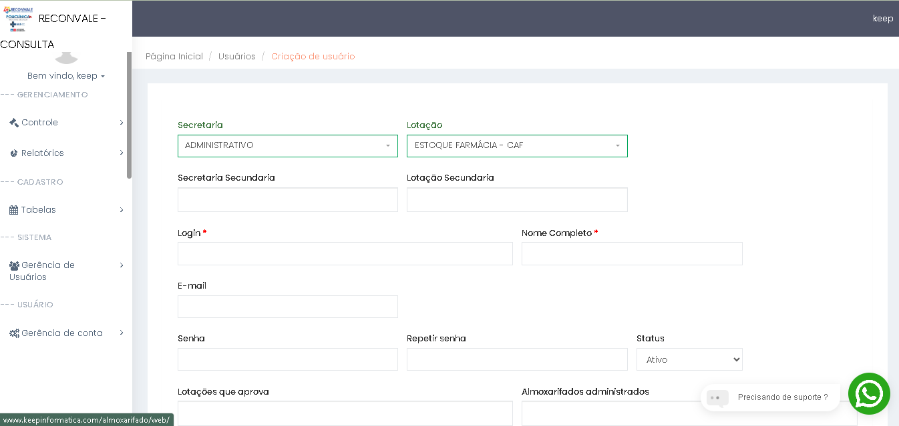

# 2. ↩️Troca Lotação/ Secretaria: Usuario com +1 de um setor:

## ✅ - Objetivo :

### 🧑🏻- Solicitação usuário:

O sistema deve permitir que os usuários possam solicitar materias para outros setores, independente da sua secretaria  ou lotação.

### 💻 - Rota/tela:

**✅ -  Alteração:**

- http://www.keepinformatica.com/almoxarifado/web/user-management/user/create;
- http://www.keepinformatica.com/almoxarifado/web/user-management/user/update?id=id
- http://www.keepinformatica.com/almoxarifado/web/user-management/user/view?id=id

---

### 📃 - Descrição:

O sistema será atualizado para permitir que os usuários realizem a troca de **"Lotação"** e **"Secretaria"**, utilizando as informações previamente cadastradas e atualizadas no perfil de cada usuário. Para facilitar esse processo, será incluído um botão na parte superior da navegação (< Navbar >), que, ao ser clicado, abrirá uma nova janela modal. Essa modal exibirá uma lista completa de **"Secretarias"** e **"Lotações"**, permitindo a seleção direta de opções.

Além disso, dois novos campos serão adicionados na seção **"Cadastro de Usuário"**, com o objetivo de armazenar informações referentes a secretaria e lotação que usuario esta habilitado ao processo de troca:

* Secretarias Secundárias: Permite ao administrador selecionar várias opções ou marcar "tudo";
* Lotações Secundárias:  Oferece funcionalidade semelhante, permitindo múltiplas escolhas ou seleção total;

Os novos campos serão denominados **"Secretarias Secundárias"** e **"Lotações Secundárias**, permitindo que o administrador opte por selecionar "tudo" ou realizar escolhas múltiplas. Esses campos seguirão o modelo do campo já existente de **"Almoxarifado Administradas"**, garantindo consistência e facilidade de uso. Adicionando essa nova função sera necessario criação de alertas informativos dos processos efetuados, sempre alertando que esta em uma "lotação" visualizando formas de evitar falhas.

---

### ☑️ - Resumo das alterações:

* [X]  Criação no banco  de duas tabelas "secretaria_secundaria" e "lotacao_secundaria";
* [X]  Criar uma modal para alteração "lotação" e "secretaria";
* [X]  Criar um novo botão na área da < navbar > - "Trocar Lotação";
* [X]  Criação de span ou informativo sempre que usuario efetuar uma nova "Requisição";
* [X]  Adicionar titulo em < navbar > qual secretaria/lotação encontra-se o usuario;

---

## 💻 - Modelagem view - Código exemplo:

### ☑️- View alterada:

⚙️ - Alteração: create + editar

* [X]  Criação dos campos "Secretaria Secundaria" e "Lotação Secundaria" abaixo dos campos "secretaria e Lota;

🔢- Código exemplo:

```
<div class="col-md-4" id="almoxarife-almoxarifado-div">
                <div class="form-group field-usuario-almoxarife_almoxarifado">
                  <label class="control-label" for="usuario-almoxarife_almoxarifado">Secretaria Secundaria</label>
<span id="parent-s2-togall-usuario-almoxarife_almoxarifado" style="display:none"><span id="s2-togall-usuario-almoxarife_almoxarifado" class="s2-togall-button s2-togall-select"><span class="s2-select-label"><i class="glyphicon glyphicon-unchecked"></i>Selecionar tudo</span><span class="s2-unselect-label"><i class="glyphicon glyphicon-check"></i>Deselecionar tudo</span></span></span><input type="hidden" name="Usuario[almoxarife_almoxarifado]" value=""><select id="usuario-almoxarife_almoxarifado" class="form-control select2-hidden-accessible" name="Usuario[almoxarife_almoxarifado][]" multiple="" size="4" data-krajee-depdrop="depdrop_49de5242" data-s2-options="s2options_9653c55f" data-krajee-select2="select2_ffd6304f" style="width: 1px; height: 1px; visibility: hidden;" data-select2-id="usuario-almoxarife_almoxarifado" tabindex="-1" aria-hidden="true"><option value="78">CENTRAL DE ABASTECIMENTO FARMACEUTICO - CAF</option><option value="79">ALMOXARIFADO CENTRAL</option><option value="80">OBSERVAÇÃO - CARRINHO DE EMERGÊNCIA</option><option value="81">TESTE ERGOMÉTRICO - CARRINHO DE EMERGÊNCIA</option><option value="82">ENDOSCOPIA - CARRINHO DE EMERGÊNCIA</option><option value="83">TOMOGRAFIA - CARRINHO DE EMERGÊNCIA</option><option value="84">RESSONÂNCIA MAGNÉTICA - CARRINHO DE EMERGÊNCIA</option></select><span class="select2 select2-container select2-container--bootstrap" dir="ltr" data-select2-id="6" style="width: 100%;"><span class="selection"><span class="select2-selection select2-selection--multiple" role="combobox" aria-haspopup="true" aria-expanded="false" tabindex="-1" aria-disabled="false"><ul class="select2-selection__rendered"><li class="select2-search select2-search--inline"><input class="select2-search__field" type="search" tabindex="0" autocomplete="off" autocorrect="off" autocapitalize="none" spellcheck="false" role="searchbox" aria-autocomplete="list" placeholder="" style="width: 0.75em;"></li></ul></span></span><span class="dropdown-wrapper" aria-hidden="true"></span></span>
```

## ☑️Criação Modal - Span:

Botão **"Trocar Lotação"** deve-se localizar na parte superior com a **cor azul** trazendo as opções de multiplo select da "Secretaria Secundaria" e "Lotação Secundaria", apenas as previamentes cadastradas.

## 🎲 - Modelagem de dados:

### ☑️ - Tabelas Criada:

#### Tabela: user_secretaria_secundaria


| Nome          | Tipo |          |
| ------------- | ---- | -------- |
| id            | int  | not null |
| fk_secretaria | int  | not null |
| fK_user       | int  | not null |

⚙️ - Relaciona com tabela secretaria.

#### Tabela: user_lotacao_secundaria


| Nome       | Tipo |          |
| ---------- | ---- | -------- |
| id         | int  | not null |
| fk_lotacao | int  | not null |
| fk_user    | int  | not null |

⚙️- Relaciona com tabela lotação.

## ⚖️ - Regras:

#### ☑️- Condicionais:

* [X]  Um usuario pode possui varias "secretaria_secundaria" e "lotacao_secundaria";
* [X]  Ao trocar de secretaria ou lotação (sera atualizado a "secretaria" ou "lotação" no banco) sera atualizada no campo fk_secretaria e fk_lotacao tornado-se a nova, sempre notificar ao usuario a  sua mudança com Span;

## ☑️- Prototipação tela:


