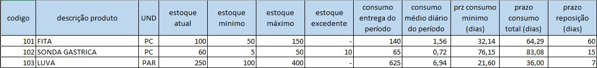

# 3. Cálculo de Estoque Máximo e Quantidade de Reposição🧮

## ✅ - Objetivo :

### 🧑🏻- Solicitação usuário:

O sistema deve permitir registrar o **"Estoque Máximo"** para cada produto e calcular a **"Quantidade Necessária"** para reposição em pedidos. Este cálculo deve considerar o estoque atual, o consumo médio e o prazo de reposição.

---

### 💻 - Rota/tela:

**✅ -  Alteração relatórios:**

http://www.keepinformatica.com/almoxarifado/web/relatorio/estoque-minimo

---

### 📃 - Descrição:

Solicitação cria uma situação de adicionar um novo registro do estoque levando agora a consideração de um **"máximo"** para cada produto que é requisitado, assim evitando problemas de sobrecarga de produtos no estoque. Será necessario criação de um novo campo **[Estoque Máximo(quant)]** em cadastro do produto ao lado do campo **"Estoque Mínimo(quant.)"**, assim criando novas possibilidade de calculos do estoque. Alguma das formas é **consumo médio de produto** que precisa calcular **total de requisição**, **numero de dias por periodos** e gerar um **consumo médio diaro**. Outro cálculo necessario é **quantidade necessária para reposição**, que é uma facilidade de controle do estoque, considerando alguns parametros que é ponto de pedido e um estoque de segurança, dentre os cálculos vem **prazo até estoque mínimo**, este cálculo determina quanto tempo o estoque acima do mínimo vai durar.

Esta solicitação descreve a necessidade de adicionar um controle de **estoque máximo** para cada produto cadastrado. O objetivo é evitar problemas de sobrecarga e excesso de itens no estoque.

Para isso, será necessária a criação de um novo campo denominado **"Estoque Máximo (Quant.)"** na tela de cadastro de produtos, preferencialmente posicionado ao lado do campo já existente "**Estoque Mínimo (Quant.)**".

A introdução do estoque máximo permitirá novas funcionalidades e cálculos de gestão, tais como:

1. **Cálculo do Consumo Médio:**
   * Esta funcionalidade exigirá o registro do **total de itens entregue**  e o **número de dias do período** analisado.
   * Com base nesses dados, o sistema poderá calcular o **consumo médio diário** do item.
2. **Cálculo da Quantidade Necessária para Reposição:**
   * Este cálculo visa facilitar o controle e a reposição do estoque.
   * Levará em consideração parâmetros como o **ponto de pedido** e o **estoque de segurança**.
   * Dentro destes cálculos, pode-se incluir também a estimativa do **prazo até atingir o estoque mínimo**, que determina por quanto tempo o saldo atual de estoque (acima do mínimo) atenderá à demanda antes de necessitar reposição.

---

### ☑️ - Resumo das alterações:

* [ ]  Criação de um novo campo "Estoque Máximo (Quant) em cadastro de produto e relatorio de "Estoque Mínimo";
* [ ]  Criação de um novo campo em **Relatorio/Estoque Mínimo** : (Base dos campos abaixo - exemplo)

* F = estoque maximo - Novo campo
* G = estoque excedente - Novo campo
* H= consumo entrega do período - Novo campo
* I  = consumo médio diário do período - Novo campo
* J = Prz consumo minimo (dias) - Novo campo
* K = Prz consumo total (dias) - Novo campo

## 🎲 - Modelagem de dados:

### 🛠️ - Tabelas alteradas:

#### Tabela: produto

Descrição: criação de uma nova coluna na tabela produtos

| Columns        | Type          |      |
| -------------- | ------------- | ---- |
| estoque_maximo | decimal(10,3) | null |

## 🔢 - Cálculos:

#### ☑️- Calcular o Consumo Médio do périodo (I);

**Novo campo:** Estoque Máximo (F) - Campo que úsuario digita no cadastro do itens;

Para calcular médio diário (I) é necessario seguinte dados:

* **`Total_Requisicoes_Periodo`**: 
  Somar a quantidade total entregue de iten_requisicao.
* **`Numero_Dias_Periodo`**:  
  Calcular o número de dias entre a Data Inicial & Data Final do período[ data_inicial/data_final].
* **`Consumo_Medio_Diario(i)** = `Total_Requisicoes_Periodo`/`Numero_Dias_Periodo`
  * *Exemplo:* 150 unidades requisitadas em 30 dias -> `Consumo_Medio_Diario` = 150 / 30 = 5 unidades/dia.

#### ☑️ - Cálculo do prazo até estoque mínimo - Pzr consumo minimo (dias) [J]

Este cálculo determina quanto tempo o estoque *acima do mínimo* vai durar. É útil para análise, mas **não calcula a quantidade a pedir:**

* **`Estoque_Utilizavel`**: `Estoque_Atual` - `Estoque_Minimo`
* `Dias_Ate_Estoque_Minimo`: `Estoque_Utilizavel` / `Consumo_Medio_Diario`  
  *(Usar a média de consumo diário)*
  * *Exemplo (Usando Estoque Atual 500, Mínimo 100, e a **média de 5 unidades/dia**):*
    * `Estoque_Utilizavel` = 500 - 100 = 400
    * `Dias_Ate_Estoque_Minimo` = 400 / 5 = 80 dias.
  * *Exemplo (Usando a **média de 20 unidades/dia** ):*
    * `Pzr Consumo minimo (J)` = 400 / 20 = 20 dias.

#### ☑️ - Estoque excedente (G):

Este cálculo determina quantidade excedente do estoque de intes que encontra-se acima do valor máximo.

Estoque excedente
**Regra:**

- Caso estoque_excedente menor que 0, trazer = 0;

**Calcular:**

estoque_excedente(G) = estoque_atual(D) - estoque_maximo(F)

#### ☑️- prazo consumo total (dias)

> Fórmula:
> `prazo até o estoque acabar = estoque atual ÷ consumo médio diário`

## ☑️- Prototipação tela:

🖼️- View: Finalizar Movimentação Geral

* A = codigo - Já existe
* B = descrição produto - Já existe
* C = UND - Já existe
* D = estoque atual - Já existe
* E = estoque minimo - Já existe
* F = estoque maximo - Novo campo (Campo digitavel pelo usuario)
* G = estoque excedente - Novo campo (Calculo Estoque excendente)
* H= consumo entrega do período - Já existe
* I  = consumo médio diário do período - Novo campo (Calculo consumo médio do périodo)
* J = Prz consumo minimo (dias) - Novo campo (Cálculo do prazo até estoque mínimoCálculo)
* K = Prz consumo total (dias) - Novo campo
* l = Prz reposição (dias) - Já existe
