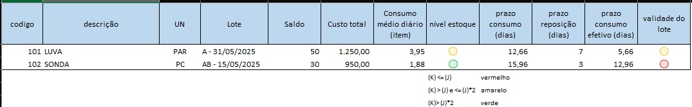

# 4. Parâmetros de Cores Indicativas de Status do Produto 🟢🟡🔴

## ✅ - Objetivo :

### 🧑🏻- Solicitação usuário:

Sinalizar visualmente os itens do estoque com cores (Verde, Amarelo, Vermelho) para indicar a criticidade, priorizando a **proximidade da data de validade** a fim de evitar perdas por vencimento.

---

### 💻 - Rota/tela:

**✅ -  Route**
http://www.keepinformatica.com.br/almoxarifado/web/relatorio/posicao-almoxarifado

---

### 📃 - Descrição:

A lógica atualmente implementada baseia-se na estimativa de quantos dias o estoque disponível pode atender à demanda, com base no consumo médio recente. A partir disso, é adotado um sistema de semáforo que utiliza cores para comunicar, de maneira lúdica e visualmente intuitiva, a situação dos itens no relatório“Posição”.

Serão apresentadas duas formas de análise:

1. Uma baseada na projeção dos dias restantes de estoque (quantidade disponível);
2. Outra considerando o tempo até o vencimento do item (data de validade).

---

### 🔢 **Campos da Tabela:**

* **A - código**: Identificação do item.
* **B - descrição**: Nome do item.
* **C - UN**: Unidade de medida.
* **D - Lote**: Identificação do lote e sua data de validade.
* **E - Saldo**: Quantidade restante do lote em estoque.
* **F - Custo total**: Valor total do saldo em estoque.
* **G - Consumo médio diário (item)**: Média de consumo diário do item (Soma Qtd.entrega / 90 dias- Fixo).
* **H - nível estoque**: Indicação visual da situação do estoque (via semáforo).
* **I - prazo consumo (dias)**: Quantos dias o estoque atual cobre, baseado no consumo médio diário.
* **J - prazo reposição (dias)**: Tempo necessário para repor o produto.
* **K -prazo consumo efetivo (dias)**: Tempo útil de consumo antes da validade expirar.
* **L - validade do lote**: Sinalização visual baseada na comparação entre consumo e vencimento.

### 🧮 **Explicações de Cálculo Campo a Campo:**

### ✅ **prazo consumo efetivo (dias)**

> Fórmula:
> `prazo consumo efetivo = prazo consumo - prazo reposição`

Exemplo (LUVA):
12,66 - 7 = **5,66 dias**
Exemplo (SONDA):
15,96 - 3 = **12,96 dias**

#### ✅ **Nivel de Estoque**

Com base nas regras:

| Regra lógica     | Cor         | Significado                                          |
| ----------------- | ----------- | ---------------------------------------------------- |
| **K ≤ J**        | 🔴 vermelho | **Estoque vence antes de ser consumido**             |
| **J < K ≤ (J×2)** | 🟡 amarelo  | **Estoque poderá ser consumido com risco moderado** |
| **K > (J×2)**      | 🟢 verde    | **Estoque será consumido bem antes da validade**    |

Onde:

* **K = prazo consumo efetivo**
* **J = dias até a validade do lote**

##### Cálculo da validade restante:

LUVA: validade = 31/05/2025 → Supondo data de hoje = 23/04/2025
→ **Dias até validade = 38 dias**
→ 5,66 ≤ 38 →
**5,66 < 38 < 76** ⇒ **🟡 amarelo**

SONDA:  validade = 15/05/2025 → 22 dias
→ 12,96 < 22 < 44 ⇒ 🟡? Não, porque: → 12,96 ≤ 22 → mas **22 ≤ 12,96 × 1** → **não**, pois **12,96 < 22**

**22 > 12,96 × 2 → 25,92?** Não, então
→ 12,96 > 22 ⇒ 🔴 vermelho (estoque não será consumido a tempo)

### 🔍 Resumo Visual:

| Item  | Prazo Consumo Efetivo | Dias até Validade | Cor         |
| ----- | --------------------- | ------------------ | ----------- |
| LUVA  | 5,66 dias             | 38 dias            | 🟡 Amarelo  |
| SONDA | 12,96 dias            | 22 dias            | 🔴 Vermelho |

