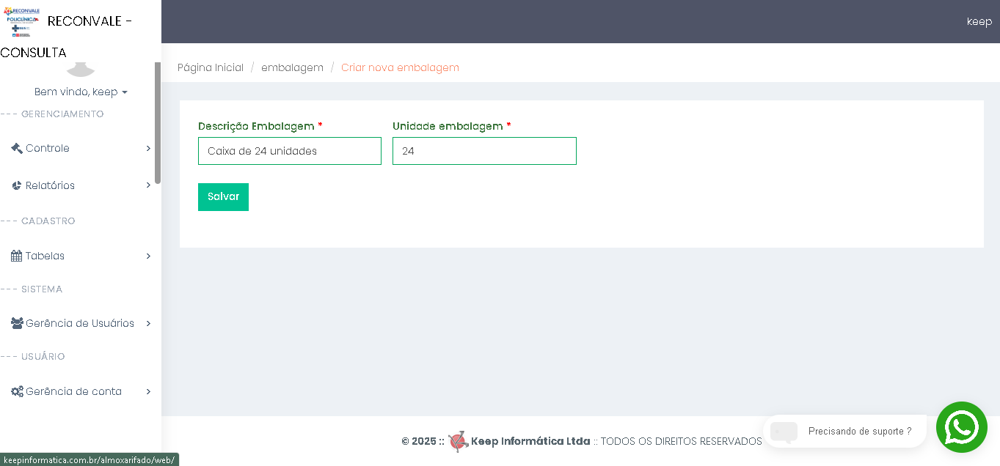
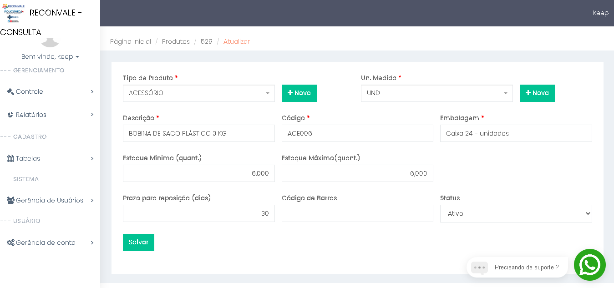

# 5. Cadastrar Fracionamento dos produtos: 🟰

## ✅ - Objetivo :

### 🧑🏻- Solicitação usuário:

Cadastrar formas de fracionamento dos itens de acordo com a necessidade, por exemplo: a "água sanitária" é comprada como caixa e distribuida internamente como frasco. Uma caixa de 12 frasco de 1L.

## 📃 - Descrição:

Será necessário criar uma nova tabela chamada `embalagem`, onde serão cadastradas as variações de fracionamento dos produtos.
Essas embalagens estarão disponíveis na seção **"Tabelas"**, sendo previamente definidas por meio de uma nova view de cadastro.

A tabela **`embalagem`** deverá conter, no mínimo, os seguintes campos:

* **`id`** (chave primária)
* **`fk_unidade_medida`** (descrição textual da embalagem)
* qtd_embalagem (Quantidade de unidade da embalagem, exemplo: Caixa de 24 Unidades = 24 unidades)

No cadastro de produtos (**`produtos`**), será adicionado um novo campo chamado **`embalagens`**, implementado como um *data-table*, permitindo a associação de múltipos tipos de embalagem a um único produto.

Essas opções de embalagem estarão disponíveis para o usuário no momento do lançamento de uma nova movimentação do tipo: **"entrada de nota"**, possibilitando selecionar a(s) embalagem(ns) adequada(s) conforme o produto e a operação.

---

### ☑️ - Resumo das alterações:

* [X]  ☑️ - Criação de uma tabela embalagem (id, descricao_embalagem, unidade_embalagem), criação de uma view contando esses campos;
* [X]  ☑️- Em produto sera adicionado um campo *data-table* , possibilitando selecionar a(s) embalagem(ns) adequadas(s) conforme produto.
* [X]  ☑️- Criação de um novo campo em "movimentação geral" para embalagem sempre que for "Operação" igual a Entrada de Nota Fiscal;
* [X]  ☑️- Após criação desse novo campo vamos precisar ciriar um controle dessa informação, sempre que usuario selecionar um tipo de embalagem,  deverar ser utilizado o calculo atualizando.

  **Exemplo:**

  **Produto:**  Acessório;

  **Un. Medida:** UND;

  **Descrição:** Bobina de saco plástico 3kg;

  **Embalagem:** caixa 24 unidades;

  Ao efetuar processo movimentação geral - entrada de nota fiscal, quantidade ira se representada pela embalagem (unidade_embalagem), não mais pela unidade e quantidade movimentada;

## 🎲 - Modelagem de dados:

### 🛠️ - Tabelas criada:

#### Tabela: embalagem

| id                  | int           | not null |
| ------------------- | ------------- | -------- |
| fk_unidade_medida | varcharint    | not null |
| qtd_embalagem   | decimal(10,2) | not null |

#### Tabela: produto_embalagem

| id           | int | not null |
| ------------ | --- | -------- |
| fk_embalagem | int | not null |
| fk_produto   | int | not null |

### Tabela altera: item_movimentacao
Adicionar embalagem 
| nome         | tipo|     |
| ------------ | --- | --- | 
| fk_embalagem | int |null |

## ☑️- Prototipação tela:

