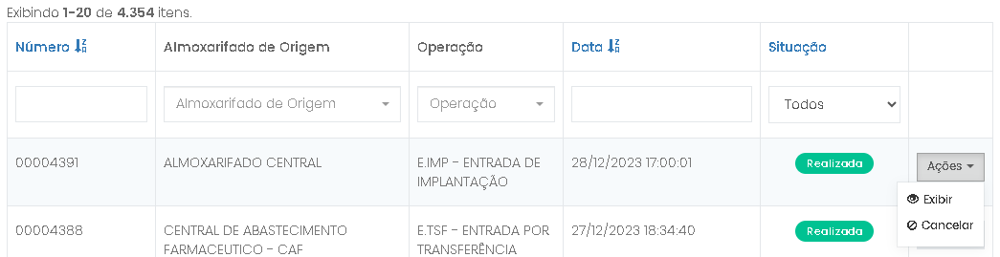
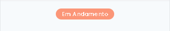
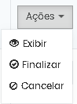
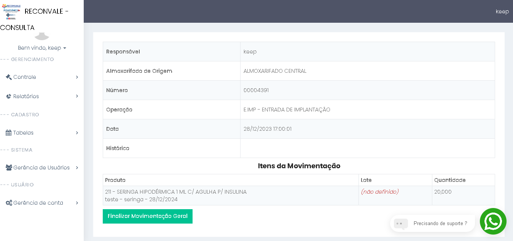
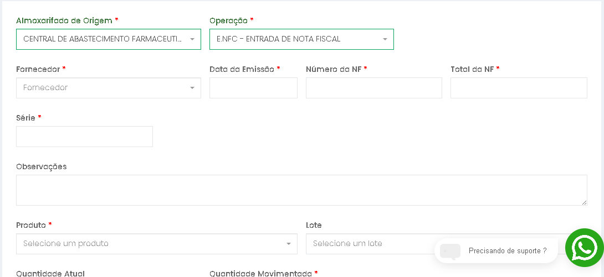
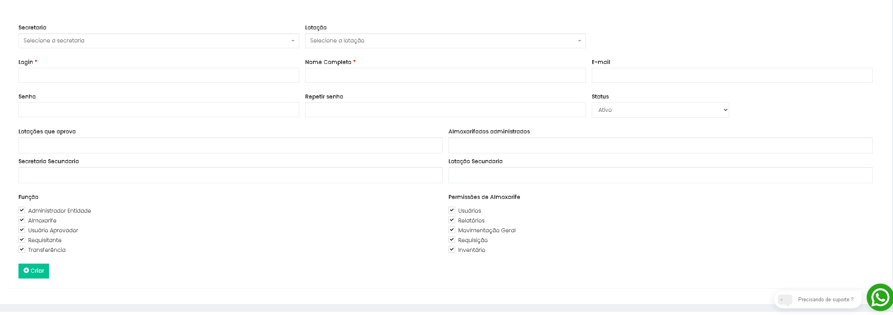
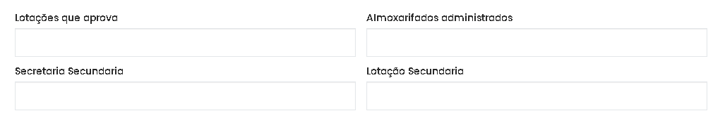

# Guia de Organização de Documento - Patrimonio

**Titulo:**  Organização mudanças sistema de patrimonio web. <br><br>
**Data inicio:**  2025-04-14 <br>
**Ultima atualização:**  2025-04-14<br>
**Version:**  1.0 <br>
**Sistema:**  Almoxarifado - web

**## Princípios Situações:****🖥️ - Solicitações:**

1. Permitir conferência e correção de entradas de notas fiscais e outros tipos de entrada;
2. Mesmo usuário pedir para vários setores
3. Estoque mínimo, estoque máximo e quantidade a ser solicitada no menu "Estoque mínimo";
4. Sinalização de itens com vencimento próximo;
5. Fracionamento dos itens;
6. 

   Anexo - solicitação do Usuario do sistema;

## Soluções - Ajustes no sistema:

## 1. Conferencia e Ajuste de emissão: ⚙️

**Solicitação úsuario:**

O sistema deve permitir que as entradas de notas fiscais possam ser continuada no dia seguinte e alteradas futuramente caso algum erro seja detectado.<br>

**Atualmente:**
Atualmente, o processo de **Movimentação Geral** funciona da seguinte maneira: ao clicar em **"Criar Movimentação Geral"**, o sistema exibe todas as solicitações de cadastro, incluindo os campos  **"Almoxarifado de Origem"** , **"Operação"** e outros parâmetros relevantes.Movimentação Geral hoje funciona da seguinte forma ao iniciar clicando em "Criar Movimentação Geral", vem todas as solicitações de cadastro "Almoxarifado de Origem", "Operação" e outros campos.  Solicitação vai ser necessario criar uma novo "Status"(Em processo) e uma nova opção em "Ações" para finalizar "Movimentação Geral".

#### Solicitação de Alteração:

1. **Novo Status**:<br>
   Será necessário adicionar o status **"Em Processo"**, para indicar que a movimentação está sendo realizada e ainda não foi concluída.
2. **Nova Opção em "Ações"**:<br>
   Será incluída uma opção na seção **Ações** para permitir a finalização da **Movimentação Geral**, facilitando o encerramento do processo diretamente pela interface.

```
Codigo:  Almoxarifado --> View --> movimentacao-geral --> index.php line
```

```
'label' => 'Situação',
                'format' => 'raw',
                'attribute' => 'status',
                'contentOptions' => ['class' => 'text-center', 'style' => 'width: 15%'],
                'filter' => Html::activeDropDownList($searchModel, 'status', ["" => 'Todos', 0 => 'Realizada', 1 => 'Cancelada'], ['class' => 'form-control']),
```

**Solução:**

1. Criação de um novo tipo de status "Situação" --> 2  => 'Em andamento';<br>

   
2. Criação de um novo botão em ações --> Finalizar ( Levando para uma nova tela de carregamento igualmente a view);<br>

   ```
   <li>
   <a class="btn-sm" href="/almoxarifado/web/movimentacao-geral/view?id=16699" data-pjax="0"
   <i class="glyphicon glyphicon-ok-circle">
   </i>
    Finalizar
   </a>
   </li>
   ```

   
3. Criação de uma nova tela de confirmação ou Fianlização dos dados trazendo resumo mais um novo botão "Finalizar" --> atualizando "Situação" para 0 => 'Realizada'; (total da nota)<br>
   Exemplo igulmente a view:
   
4. Criação de um novo campo ao selecionar "Entrada de Nota Fiscal" (Um cadastro de NFS - Nota fiscal) - sera necessario criação desse campo "Total da Nota" aonde ao finalizar utilizara para calculo de conferencia de preenchimento das informações.

## 2. Alteração de Lotações X Secretarias 🛠️

**Solicitação Usuario:**  <br>

O Sistema deve permitir que os usuários possam solicitar materiais para outros setores, independente da sua secretaria ou lotação. (Solicitação do cliente)

**Descrição alteração:**

O sistema será atualizado para permitir que o usuário realize a troca de "Lotação" e "Secretaria", com base nas informações previamente cadastradas e atualizadas no perfil do usuário. Será adicionado um botão na parte superior da navegação ( < Nav > ), visando facilitar o processo de alteração. Este botão abrirá uma nova janela modal, exibindo uma lista de "Secretarias" e "Lotações" disponíveis para seleção.

O sistema será atualizado para permitir que os usuários realizem a troca de **"Lotação"** e **"Secretaria"**, utilizando as informações previamente cadastradas e atualizadas no perfil de cada usuário. Para facilitar esse processo, será incluído um botão na parte superior da navegação (< Navbar >), que, ao ser clicado, abrirá uma nova janela modal. Essa modal exibirá uma lista completa de **"Secretarias"** e **"Lotações"**, permitindo a seleção direta de opções.

Além disso, dois novos campos serão adicionados na seção **"Cadastro de Usuário"**, com o objetivo de armazenar informações referentes ao processo de troca:

* **Secretarias Secundárias** : Permite ao administrador selecionar várias opções ou marcar "tudo".
* **Lotações Secundárias**:  Oferece funcionalidade semelhante, permitindo múltiplas escolhas ou seleção total.

Os novos campos seguirão o modelo de interação e usabilidade já estabelecido pelo campo existente de **"Almoxarifado Administradas"**, garantindo uniformidade e facilidade no uso da interface.

Além disso, será necessário incluir dois novos campos no **"Cadastro de Usuário"** para registrar informações relacionadas ao processo de troca. Os novos campos serão denominados **"Secretarias Secundárias"** e **"Lotações Secundárias**, permitindo que o administrador opte por selecionar "tudo" ou realizar escolhas múltiplas. Esses campos seguirão o modelo do campo já existente de **"Almoxarifado Administradas"**, garantindo consistência e facilidade de uso.

**Inclusão:**

> * Criar um novo botão na área do < Navbar > "Trocar Lotação";
> * Modal (Com campos Lotação Secundaria e Secretaria Secundaria) listando os dados cadastrado ao usuario;
> * Campos em "cadastro de usuario" com opção de multipla escolha (selecionar tudo) - "Secretaria Secundaria" e "Lotação secundaria"
>
>   http://www.keepinformatica.com/almoxarifado/web/user-management/user/create
>
>   
>
>   
> * Criação de um span (Toda vez que o usuario for "Criar Requisição", aparecer um span [ Usuário esta lotado na lotação [Lotação] - [ secretaria], assim evitando que o usuario crie erros de requisição, ao "Salvar" deve-se criar outro < span > que solicite confirmação do usuario trazendo as mesmas informações { [usuario] esta lotado na [lotaçao] - [ secretaria]}).

## 3. Cálculo de Estoque Máximo e Quantidade de Reposição🧮

### 3.1. Solicitação do Usuário

O sistema deve permitir registrar o **"Estoque Máximo"** para cada produto e calcular a **"Quantidade Necessária"** para reposição em pedidos. Este cálculo deve considerar o estoque atual, o consumo médio e o prazo de reposição (lead time).

### 3.2. Configuração e Cálculo do Consumo Médio

**Passo 1: Adicionar Campo de Estoque Máximo**

* Incluir um novo campo numérico `Estoque_Maximo_Quant` na tela de Cadastro de Produto.
* Permitir que o usuário defina a quantidade máxima desejada para o produto no estoque.

**Passo 2: Calcular o Consumo Médio Diário**

* **`Total_Requisicoes_Periodo`**: Somar a quantidade total requisitada/consumida do produto dentro do Período de Análise selecionado.
* **`Numero_Dias_Periodo`**: Calcular o número de dias entre a Data Inicial & Data Final do período.
* **`Consumo_Medio_Diario`** = `Total_Requisicoes_Periodo` / `Numero_Dias_Periodo`
  * *Exemplo:* 150 unidades requisitadas em 30 dias -> `Consumo_Medio_Diario` = 150 / 30 = 5 unidades/dia.

### 3.3. Cálculo da Quantidade Necessária para Reposição (Adicional sobre solicitação)

**Passo 3: Obter Dados Atuais**

* **`Estoque_Atual`**: Quantidade atual do produto em estoque.
* **`Estoque_Minimo`**: Quantidade mínima definida para o produto.
* **`Estoque_Maximo`**: Quantidade máxima.
* **`Consumo_Medio_Diario`**: Valor calculado.

**Passo 4: Calcular a Quantidade Necessária**

* **Considerando Ponto de Pedido e Lead Time:**

  * Deixando mais preciso, pois aciona o pedido quando o estoque atinge um "Ponto de Pedido" calculado para cobrir o consumo durante o prazo de reposição.
  * **`Estoque_Seguranca`**: Frequentemente igual ao `Estoque_Minimo` ou um pouco acima.
  * **`Consumo_Durante_Reposicao`**: `Consumo_Medio_Diario` * `Prazo_Reposicao_Dias`
  * **`Ponto_Pedido`**: `Consumo_Durante_Reposicao` + `Estoque_Seguranca`
  * **SE `Estoque_Atual` <= `Ponto_Pedido` ENTÃO:**
    * **`Quantidade_Necessaria` = (`Estoque_Maximo` - `Estoque_Atual`)
  * **SENÃO:**
    * `Quantidade_Necessária` = 0 (Não é necessário pedir ainda).

### 3.4. Cálculo do Prazo até Estoque Mínimo

Este cálculo determina quanto tempo o estoque *acima do mínimo* vai durar. É útil para análise, mas **não calcula a quantidade a pedir**.

* **`Estoque_Utilizavel`**: `Estoque_Atual` - `Estoque_Minimo`
* **`Dias_Ate_Estoque_Minimo`**: `Estoque_Utilizavel` / `Consumo_Medio_Diario` *(Usar a média de consumo diário)*
  * *Exemplo (Usando Estoque Atual 500, Mínimo 100, e a **média de 5 unidades/dia**):*
    * `Estoque_Utilizavel` = 500 - 100 = 400
    * `Dias_Ate_Estoque_Minimo` = 400 / 5 = 80 dias.
  * *Exemplo (Usando a **média de 20 unidades/dia** ):*
    * `Dias_Ate_Estoque_Minimo` = 400 / 20 = 20 dias.

## 4. Parâmetros de Cores Indicativas de Status do Produto 🟢🟡🔴

### 4.1. Solicitação Original do Usuário

Sinalizar visualmente os itens do estoque com cores (Verde, Amarelo, Vermelho) para indicar a criticidade, priorizando a **proximidade da data de validade** a fim de evitar perdas por vencimento.

### 4.2. Lógica: Sinalização por Dias de Estoque Restante

A implementação atual utiliza uma lógica baseada em quantos dias o estoque atual deve durar, considerando o consumo médio recente.

**Passo 1: Calcular o Consumo Médio Diário (últimos 90 dias)**

* **`Data de Referência`**:  Definir como a data atual (data_final => 'Data de Referência') [ RelatorioPosicaoForm.php].
* **`QTD_Total`**: Somar a quantidade total movimentada (saídas/consumo) do produto nos 90 dias anteriores à `Data de Referência`.
  * *Exemplo (Conceitual):*
    ```sql
    SUM(Quantidade)
    WHERE TipoMovimento = 'Saida'
      AND DataMovimento BETWEEN (DataReferencia - 90 dias) AND DataReferencia
    ```
* **`consumo_Medio_Diario`**: `QTD_Total/90`

**Passo 2: Calcular os Dias de Estoque Restante**

* **`Saldo_Total_Atual`**: Obter o saldo de estoque físico atual do produto.
* **`Dias_Estoque_Restante`**: `Saldo_Total_Atual / Consumo_Medio_Diario`
  * *(Nota: Tratar divisão por zero se `Consumo_Medio_Diario` for 0).*

**Passo 3: Definir a Cor com Base nos Dias de Estoque Restante**

* Se `Dias_Estoque_Restante` <= 7: **Vermelho** 🔴 (Estoque crítico baixo)
* Se `Dias_Estoque_Restante` > 7 E `Dias_Estoque_Restante` <= 20: **Amarelo** 🟡 (Estoque em atenção)
* Se `Dias_Estoque_Restante` > 20: **Verde** 🟢 (Estoque confortável)

### 4.3. Proximidade da Validade (Novo calculo):

Para atender ao pedido de sinalizar por **proximidade da validade**, uma lógica diferente (ou complementar) é necessária, acessando a data de validade registrada nos Lotes:

**Passo 1: Obter a Data de Validade**

* Para cada Lote do produto em estoque, obter a `Data_Validade`. Considerar o lote com a data de validade mais próxima (princípio FEFO - First Expire, First Out é o mais comum aqui).

**Passo 2: Calcular Dias Para Vencer**

* **`Data_Validade_Mais_Proxima`**: A data de validade mais próxima entre os lotes em estoque.
* **`Dias_Para_Vencer`**: `Data_Validade - Data_Atual`

**Passo 3: Definir a Cor com Base nos Dias Para Vencer**

* Se `Dias_Para_Vencer` <= 30: **Vermelho** 🔴 (Vencimento muito próximo)
* Se `Dias_Para_Vencer` > 30 E `Dias_Para_Vencer` <= 90: **Amarelo** 🟡 (Vencimento em médio prazo)
* Se `Dias_Para_Vencer` > 90: **Verde** 🟢 (Vencimento distante)

  * *(Nota: Os prazos como 30/90 dias são apenas exemplos e podem ser ajustados).*

## 4.1 - Parametros Reposição (🔴🟢⚪)

Cor menor que (prazo_reposiacao) = vermelho senão é verde; <br>

Caso Prazo para reposição sejá igual 0 ou null => cor sera igual ⚪ - cinza


| Codgo produto | Descrição | UN. | Lote     | CMD | Saldo | Custo Total | N.Estoque | Prazo Reposição | reposição |
| ------------- | ----------- | --- | -------- | --- | ----- | ----------- | --------- | ----------------- | ----------- |
| 12            | Álcoo      | UND | Sem Lote | --  | --    | ---         | 🔴        | --                | 🔴          |

## 5 . Cadastrar Fracionamento dos produtos: 🟰

### 5.1. Solicitação do Usuário

Cadastrar formas de fracionamento dos itens de acordo com a necessidade por exemplo: A "Água Sanitária" é comprada como caixa e distribuida internamente como frasco uma caixa tem 12 frasco de 1litro.
