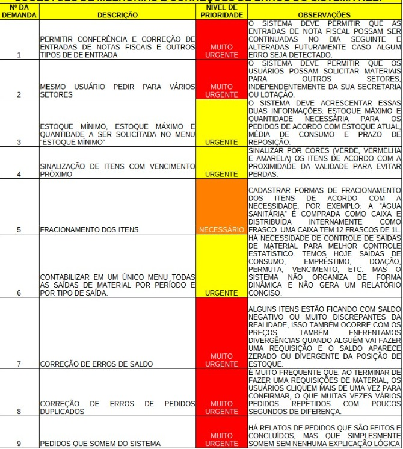

# Guia de Organização de Documento - Almoxarifado

**Titulo:**  Organização mudanças sistema de Almoxarifado web.<Br>
**Data inicio:**  2025-04-14 <br>
**Ultima atualização:**  2025-04-14<br>
**Version:**  1.0 <br>
**Sistema:**  Almoxarifado - web

## Princípios Situações - Solicitações

1. Permitir conferência e correção de entradas de notas fiscais e outros tipos de entrada;
2. Mesmo usuário pedir para vários setores
3. Estoque mínimo, estoque máximo e quantidade a ser solicitada no menu "Estoque mínimo";
4. Sinalização de itens com vencimento próximo;
5. Fracionamento dos itens;
6. 

   Anexo - solicitação do Usuario do sistema;

## 4. Parâmetros de Cores Indicativas de Status do Produto 🟢🟡🔴

### 4.1. Solicitação Original do Usuário

Sinalizar visualmente os itens do estoque com cores (Verde, Amarelo, Vermelho) para indicar a criticidade, priorizando a **proximidade da data de validade** a fim de evitar perdas por vencimento.

### 4.2. Lógica: Sinalização por Dias de Estoque Restante

A implementação atual utiliza uma lógica baseada em quantos dias o estoque atual deve durar, considerando o consumo médio recente.

**Passo 1: Calcular o Consumo Médio Diário (últimos 90 dias)**

* **`Data de Referência`**:  Definir como a data atual (data_final => 'Data de Referência') [ RelatorioPosicaoForm.php].
* **`QTD_Total`**: Somar a quantidade total movimentada (saídas/consumo) do produto nos 90 dias anteriores à `Data de Referência`.
  * *Exemplo (Conceitual):*
    ```sql
    SUM(Quantidade)
    WHERE TipoMovimento = 'Saida'
      AND DataMovimento BETWEEN (DataReferencia - 90 dias) AND DataReferencia
    ```
* **`consumo_Medio_Diario`**: `QTD_Total/90`

**Passo 2: Calcular os Dias de Estoque Restante**

* **`Saldo_Total_Atual`**: Obter o saldo de estoque físico atual do produto.****
* **`Dias_Estoque_Restante`**: `Saldo_Total_Atual / Consumo_Medio_Diario`
  * *(Nota: Tratar divisão por zero se `Consumo_Medio_Diario` for 0).*

**Passo 3: Definir a Cor com Base nos Dias de Estoque Restante**

* Se `Dias_Estoque_Restante` <= 7: **Vermelho** 🔴 (Estoque crítico baixo)
* Se `Dias_Estoque_Restante` > 7 E `Dias_Estoque_Restante` <= 20: **Amarelo** 🟡 (Estoque em atenção)
* Se `Dias_Estoque_Restante` > 20: **Verde** 🟢 (Estoque confortável)

### 4.3. Proximidade da Validade (Novo calculo):

Para atender ao pedido de sinalizar por **proximidade da validade**, uma lógica diferente (ou complementar) é necessária, acessando a data de validade registrada nos Lotes:

**Passo 1: Obter a Data de Validade**

* Para cada Lote do produto em estoque, obter a `Data_Validade`. Considerar o lote com a data de validade mais próxima (princípio FEFO - First Expire, First Out é o mais comum aqui).

**Passo 2: Calcular Dias Para Vencer**

* **`Data_Validade_Mais_Proxima`**: A data de validade mais próxima entre os lotes em estoque.
* **`Dias_Para_Vencer`**: `Data_Validade - Data_Atual`

**Passo 3: Definir a Cor com Base nos Dias Para Vencer******

* Se `Dias_Para_Vencer` <= 30: **Vermelho** 🔴 (Vencimento muito próximo)
* Se `Dias_Para_Vencer` > 30 E `Dias_Para_Vencer` <= 90: **Amarelo** 🟡 (Vencimento em médio prazo)
* Se `Dias_Para_Vencer` > 90: **Verde** 🟢 (Vencimento distante)

  * *(Nota: Os prazos como 30/90 dias são apenas exemplos e podem ser ajustados).*

## 4.1 - Parametros Reposição (🔴🟢⚪)

Cor menor que (prazo_reposiacao) = vermelho senão é verde; <br>

Caso Prazo para reposição sejá igual 0 ou null => cor sera igual ⚪ - cinza


| Codgo produto | Descrição | UN. | Lote     | CMD | Saldo | Custo Total | N.Estoque | Prazo Reposição | reposição |
| ------------- | ----------- | --- | -------- | --- | ----- | ----------- | --------- | ----------------- | ----------- |
| 12            | Álcoo      | UND | Sem Lote | --  | --    | ---         | 🔴        | --                | 🔴          |

## 5 . Cadastrar Fracionamento dos produtos: 🟰

### 5.1. Solicitação do Usuário

Cadastrar formas de fracionamento dos itens de acordo com a necessidade por exemplo: A "Água Sanitária" é comprada como caixa e distribuida internamente como frasco uma caixa tem 12 frasco de 1litro.
